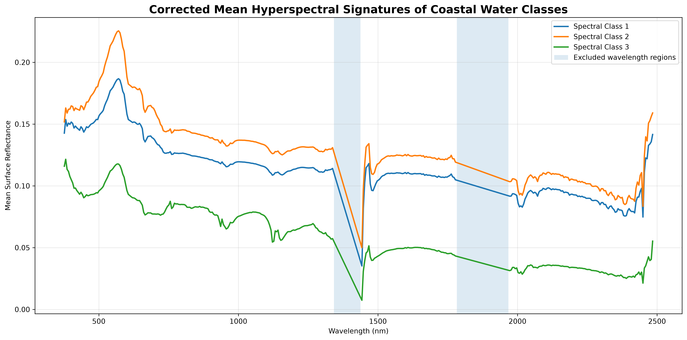
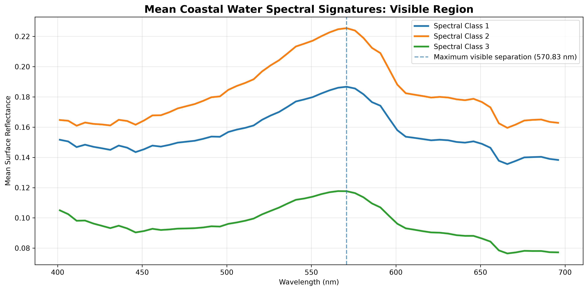
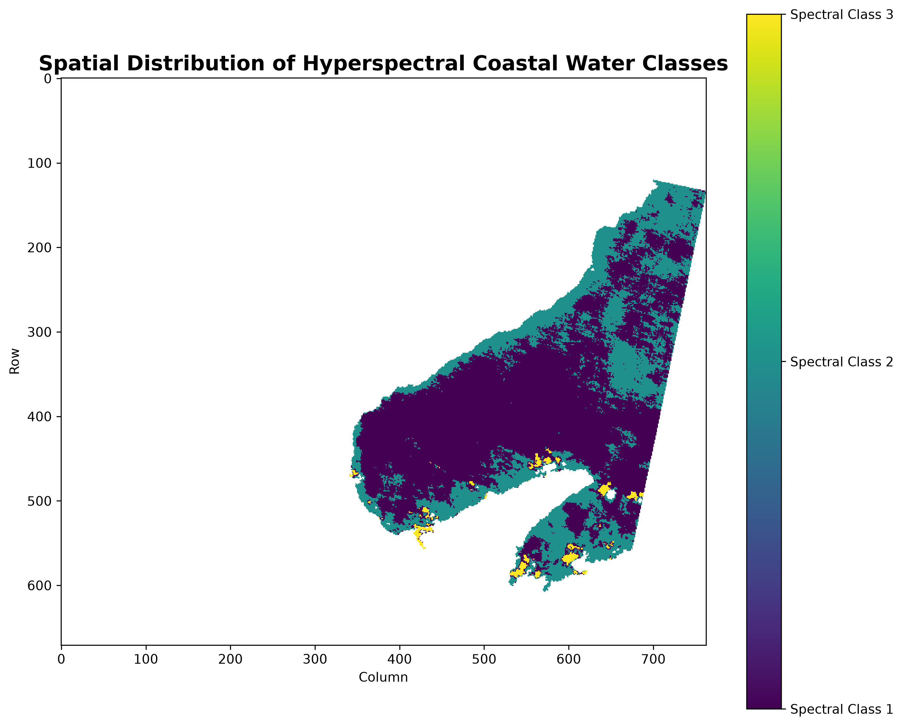

# GeoSpectra AI

## Hyperspectral Assessment of Coastal Water Quality in Corozal, Belize Using Planet Tanager Open Data

An independent geospatial research project developed for the **Planet Tanager Open Data Competition 2026**.

This project investigates how high-dimensional hyperspectral surface-reflectance data from Planet Tanager can be used to characterize spatial variability in coastal waters and identify distinct spectral water regimes in **Corozal Bay, Belize**.

> **Important:** The current analysis is exploratory. The spectral classes and indices produced by this project represent relative optical/spectral variability and are **not calibrated measurements** of turbidity, chlorophyll-a, suspended sediment concentration, or other water-quality parameters.

---

## Study Area

**Corozal, Belize**

The analysis focuses on coastal waters within Corozal Bay using a Planet Tanager hyperspectral scene acquired on **24 August 2025**.

---

## Dataset

- **Satellite / Sensor:** Planet Tanager
- **Product:** Surface Reflectance
- **Native spectral bands:** 426
- **Bands retained for analysis:** 365
- **Approximate final spectral range:** 376.44–2484.13 nm
- **Native spatial resolution:** 32.86 m
- **Coordinate Reference System:** EPSG:32616 — WGS 84 / UTM Zone 16N
- **Scene acquisition date:** 24 August 2025
- **File format:** HDF5 / HDF-EOS

---

## Research Objectives

1. Explore and document the Tanager hyperspectral data structure and metadata.
2. Visualize the hyperspectral scene using RGB composites and individual spectral bands.
3. Investigate representative hyperspectral signatures.
4. Develop a coastal-water mask and isolate the main connected water body.
5. Calculate relative spectral indicators and examine their spatial variability.
6. Apply dimensionality reduction and unsupervised machine learning to identify spectrally distinct coastal-water regimes.
7. Evaluate the spatial distribution and spectral characteristics of the resulting classes.

---

## Methodology

```text
Planet Tanager Surface Reflectance
              │
              ▼
      HDF5 Data Exploration
              │
              ▼
      RGB & Spectral Visualization
              │
              ▼
     Spectral Signature Analysis
              │
              ▼
       Coastal Water Masking
              │
              ▼
 Relative Spectral Feature Mapping
              │
              ▼
   Spectral Quality Screening
              │
              ▼
     PCA Dimensionality Reduction
              │
              ▼
      K-Means Unsupervised Clustering
              │
              ▼
     Spatial Spectral-Class Mapping
              │
              ▼
     Statistical & Spatial Analysis

```

---

## Key Visual Results

### Full Hyperspectral Class Signatures

Mean hyperspectral signatures for the three data-driven coastal-water spectral classes identified through the analysis.



### Visible-Region Spectral Signatures

The visible region shows clear differences in reflectance between the three spectral classes, with the strongest reliable visible separation occurring near 570.83 nm.



### Spatial Distribution of Spectral Classes

K-means clustering reveals spatially distinct hyperspectral spectral regimes across the main connected coastal-water body.

